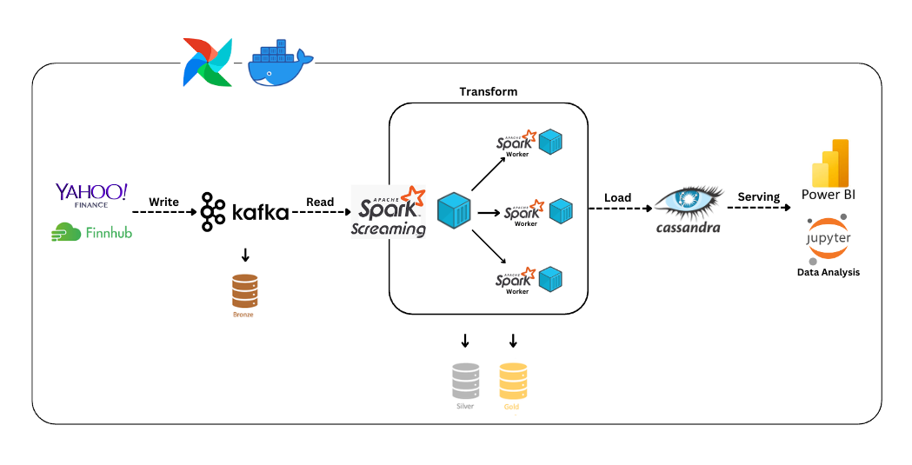
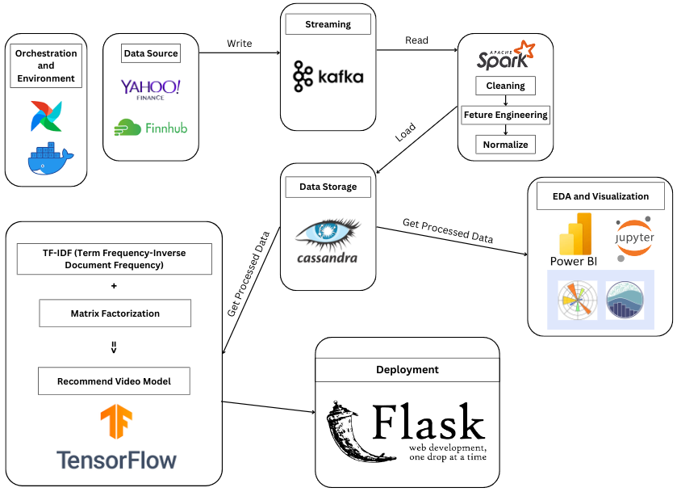

# 🌄 Finance Data Ingestion Pipeline with Kafka

In this project, I built a real-time data ingestion pipeline with Apache Kafka and Spark Streaming to collect and process financial data from Yahoo Finance and Finnhub, analyze it in Jupyter Notebook, and generate financial reports using Power BI.

## 🔦 About Project

## 🚀 Workflow

